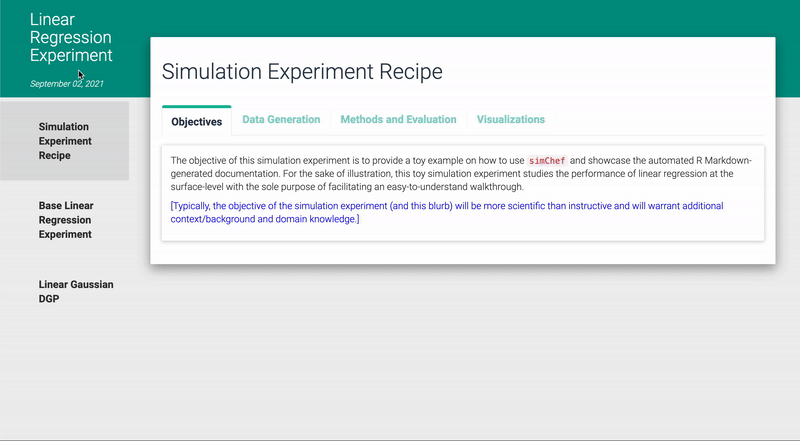

class: hide_logo

```{r xaringan-themer, include=FALSE, warning=FALSE}
xaringanthemer::style_mono_accent(
  # base_color = "#00b0da",
  # base_color = "#008878",
  base_color = "#005596",
  header_font_google = xaringanthemer::google_font("Josefin Sans"),
  text_font_google = xaringanthemer::google_font("Montserrat", "300", "300i"),
  code_font_google = xaringanthemer::google_font("Fira Mono"),
  outfile = "css/xaringan-themer.css"
)
```

```{r xarigan-extra, echo=FALSE}
xaringanExtra::use_xaringan_extra(
  include = c("tile_view", "animate_css", "tachyons", "panelset", "broadcast",
              "fit_screen", "cliboard", "search", "freezeframe")
)

```

```{r xaringan-extra-styles, echo=FALSE}
xaringanExtra::use_extra_styles(
  hover_code_line = TRUE,         #<<
  mute_unhighlighted_code = TRUE  #<<
)
```

```{r xaringan-extra-progress, echo=FALSE}
xaringanExtra::use_progress_bar(color = "#fbb040", location = "top")
```

```{r xaringan-extra-logo, echo=FALSE}
xaringanExtra::use_logo(
  image_url = "images/simChef-hex-v2.png"
)
```

```{r xaringan-extra-animate-all, echo=FALSE}
xaringanExtra::use_animate_all("fade")
```

```{r include=FALSE}
library(simChef)
```

.center.hex-logo[]

.center[
```r
devtools::install_github("Yu-Group/simChef")
```
]

.center.faces[
.fl.w-20[]
.fl.w-20[]
.fl.w-20[]
.fl.w-20[]
.fl.w-20[]
]
.center.faces[
.fl.w-20.f6[J. Duncan]
.fl.w-20.f6[T. Tang]
.fl.w-20.f6[C.F. Elliott]
.fl.w-20.f6[P. Boileau]
.fl.w-20.f6[B. Yu]
]<br />

---

# Today's recipe

### 1. Overview (~5-10 min)

--
class: no-animation

- Why we created `simChef`

--
- Core abstractions in `R6`

--

### 2. Dive into `simChef`'s features (~30-40 min)

--
- Tidyverse-like "grammar of simulations"

--
- Inputs and outputs of your functions

--
- Building the components of a `simChef::Experiment`

--
- Running and debugging

--
- Summarizing and documenting your simulation

--

### 3. Q&A (~5-10 min)

---

# Overview

`simChef` is an R package to facilitate **transparent** and **reliable** simulation
experiments, with PCS as the guiding framework.

.center.recipe1[]

---

# Overview

`simChef` is an R package to facilitate **transparent** and **reliable** simulation
experiments, with PCS as the guiding framework.

.center.recipe2[]

---

# Overview

`simChef` is an R package to facilitate **transparent** and **reliable** simulation
experiments, with PCS as the guiding framework.

.center.recipe3[]

---

# Overview

`simChef` is an R package to facilitate **transparent** and **reliable** simulation
experiments, with PCS as the guiding framework.

.center.recipe4[]

---

# A simulation with MERITS

<span style="font-size: 32pt; font-family: bold">**M**</span>**odular**: 
code and design should be divided into **logical**, **reusable** parts.

--

<span style="font-size: 32pt; font-family: bold">**E**</span>**fficient**:
simulations should take advantage of **distributed computation**.

--

<span style="font-size: 32pt; font-family: bold">**R**</span>**ealistic**:
simulations should resemble the **real world** as much as possible.

--

<span style="font-size: 32pt; font-family: bold">**I**</span>**ntuitive**:
simulation architecture should be **readable** and **understandable**.

--

<span style="font-size: 32pt; font-family: bold">**T**</span>**ransparent**:
goals should be **clearly defined**; results communicated **honestly**.

--

<span style="font-size: 32pt; font-family: bold">**S**</span>**table**:
simulations should be **consistent** (e.g., over seeds) and **reproducible**.

---

# The `simChef` Vision


* Versatile **R framework** to support simulation studies satisfying these MERITS

--

* Allow data scientists to focus on substantive questions with **fewer technical distractions**

--

* **Lower** the **activation barrier** to running high-quality simulation studies

--

* Provide comprehensive simulation **documentation and archive** of simulation artifacts for **transparency and reproducibility**

---

# `simChef` Highlights

* An **intuitive grammar** for simulation studies

--

* Automated **documentation** and **visualization** of results

--

* **Caching** of results

--

* Ease of **parallelization**

--

* **Debugging** tools

---

# An intuitive grammar for simulation studies

```{r, eval=FALSE}
# create experiment
my_exper <- create_experiment(name = "Experiment") %>%
  add_dgp(my_dgp, name = "DGP1") %>%
  add_method(my_method, name = "Method1") %>%
  add_evaluator(my_evaluator, name = "Eval1") %>%
  add_visualizer(my_visualizer, name = "Viz1") %>%
  add_vary_across(.dgp = "DGP1",
                  n = c(10, 100, 1000))

# run experiment
my_results <-  run_experiment(my_exper, n_reps = 25)

# document and visualize experiment results
create_doc_template(my_exper)
render_docs(my_exper)
```

---

# Core abstractions

We use [`R6`](https://r6.r-lib.org/index.html) to encompass these simulation components:

--

**`simChef::DGP`**

.inset.ml3[Data-generating processes which define the “ground truth” and flexibly generate simulated data.]

--

**`simChef::Method`**

.inset.ml3[The main objects of study (your method), along with competitors / baselines.]

--

**`simChef::Evaluator`**

.inset.ml3[Produce meaningful summaries of the results.]

--

**`simChef::Visualizer`**

.inset.ml3[Output plots, tables, R Markdown, LaTeX, etc. to populate interactive experiment documentation.]

--

**`simChef::Experiment`**

.inset.ml3[Puts together all of the above.]

---

# A grammar of data

```{r, eval=FALSE}
library(simChef)
set.seed(123)

my_dgp <- DGP$new(function(n) rnorm(n), "my-dgp")
```

---
count: false

# A grammar of data

```{r, eval=FALSE}
library(simChef)
set.seed(123)

my_dgp <- create_dgp(function(n) rnorm(n), "my-dgp")
```

---
count: false

# A grammar of data

```{r}
library(simChef)
set.seed(123)

my_dgp <- create_dgp(function(n) rnorm(n), "my-dgp")
my_data <- my_dgp$generate(3)
str(my_data)
```

---
count: false

# A grammar of methods

```{r}
library(simChef)
set.seed(123)

my_dgp <- create_dgp(function(n) rnorm(n), "my-dgp")
my_data <- my_dgp$generate(3)
str(my_data)

my_method <- create_method( # or Method$new(...)
  function(x) mean(x), "my-method"
)
```

---
count: false

# A grammar of methods

```{r}
library(simChef)
set.seed(123)

my_dgp <- create_dgp(function(n) rnorm(n), "my-dgp")
my_data <- my_dgp$generate(3)
str(my_data)

my_method <- create_method( # or Method$new(...)
  function(x) mean(x), "my-method")

my_results <- my_method$fit(my_data)
my_results
```

---

# A grammar of replicates

```{r, eval=FALSE}
my_exper <- create_experiment( # or Experiment$new(...)
  name = "my-exper"
)
```

---

# A grammar of replicates

```{r, eval=FALSE}
my_exper <- create_experiment(name = "my-exper")
```

---
count: false

# A grammar of replicates

```{r, eval=FALSE}
my_exper <- create_experiment(name = "my-exper") %>%
  add_dgp(my_dgp)
```

---
count: false

# A grammar of replicates

```{r, eval=FALSE}
my_exper <- create_experiment(name = "my-exper") %>%
  add_dgp(my_dgp) %>%
  add_method(my_method)
```

---
count: false

# A grammar of replicates

```{r, eval=TRUE}
my_exper <- create_experiment(name = "my-exper") %>%
  add_dgp(my_dgp) %>%
  add_method(my_method) %>%
  add_vary_across(.dgp = my_dgp,
                  n = c(10, 100, 1000))
```

---
count: false

# A grammar of replicates

```{r, eval=TRUE}
my_exper <- create_experiment(name = "my-exper") %>%
  add_dgp(my_dgp) %>%
  add_method(my_method) %>%
  add_vary_across(.dgp = my_dgp,
                  n = c(10, 100, 1000))
my_exper
```

---
count: false

# A grammar of replicates

```{r, eval=FALSE}
my_exper <- create_experiment(name = "my-exper") %>%
  add_dgp(my_dgp) %>%
  add_method(my_method) %>%
  add_vary_across(.dgp = my_dgp,
                  n = c(10, 100, 1000))

my_results <- fit_experiment( # or my_exper$fit(...)
  my_exper, n_reps = 25
)
```

---
count: false

# A grammar of replicates

```{r, cache=TRUE}
my_exper <- create_experiment(name = "my-exper") %>%
  add_dgp(my_dgp) %>%
  add_method(my_method) %>%
  add_vary_across(.dgp = my_dgp,
                  n = c(10, 100, 1000))

my_results <- fit_experiment( # or my_exper$fit(...)
  my_exper, n_reps = 25
)
my_results
```

---

# A grammar of simulations

```{r, eval=FALSE}
# user's function must have a `fit_results` arg
# can also take a `vary_params` arg and additional custom args
my_eval <- create_evaluator(...)
```

```{r, eval=FALSE, include=FALSE}
my_eval <- create_evaluator(
  function(fit_results) { # fit_results is required
    require(dplyr)
    fit_results %>%
      group_by(n) %>%
      summarize(sd_res = sd(result1)) %>%
      mutate(se_res = sd_res / sqrt(n))
  }
)
```

---
count: false

# A grammar of simulations

```{r, eval=FALSE}
# user's function must have a `fit_results` arg
# can also take a `vary_params` arg and additional custom args
my_eval <- create_evaluator(...)

# user's function should have either a `fit_results` or `eval_results` arg
# can also take a `vary_params` arg and additional custom args
my_viz <- create_vizualizer(...)
```

---
count: false

# A grammar of simulations

```{r, eval=FALSE}
# user's function must have a `fit_results` arg
# can also take a `vary_params` arg and additional custom args
my_eval <- create_evaluator(...)

# user's function should have either a `fit_results` or `eval_results` arg
# can also take a `vary_params` arg and additional custom args
my_viz <- create_vizualizer(...)

my_exper %>%
  add_evaluator(my_eval, "my-eval") %>%
  add_visualizer(my_viz, "my-viz")
```

---
count: false

# A grammar of simulations

```{r, eval=FALSE}
# user's function must have a `fit_results` arg
# can also take a `vary_params` arg and additional custom args
my_eval <- create_evaluator(...)

# user's function should have either a `fit_results` or `eval_results` arg
# can also take a `vary_params` arg and additional custom args
my_viz <- create_vizualizer(...)

my_exper %>%
  add_evaluator(my_eval, "my-eval") %>%
  add_visualizer(my_viz, "my-viz")

run_experiment(my_exper) # reps + eval + viz
```

---
# Running and debugging

You can find a similar example at https://yu-group.github.io/simChef/articles/parallel.html

Required packages: `simChef`, `glmnet`, `MASS`.

--
Some slightly more interesting `DGP` functions:

```{r}
dense_dgp_fun <- function(n=100, rho=0.5, noise_level=1) {
  cov_mat <- diag(nrow = 5)
  cov_mat[cov_mat == 0] <- rho
  X <- MASS::mvrnorm(n = n, mu = rep(0, 5), Sigma = cov_mat)
  y <- cbind(1, X) %*% c(-8, 3, -1, 0.1, 0.5, 1) + rnorm(n, sd = noise_level)
  return(list(X = X, y = y, coeff = c(3, -1, 0.1, 0.01, 0.001)))
}
```

--
```{r}
sparse_dgp_fun <- function(n=100, d=100, rho=0.5, 
                           sparsity=0.5, noise_level=1,
                           nonzero_coeff = c(-3, -1, 1, 3)) {
  cov_mat <- diag(nrow = d)
  cov_mat[cov_mat == 0] <- rho
  X <- MASS::mvrnorm(n = n, mu = rep(0, d), Sigma = cov_mat)
  coeff_prob <- c(sparsity, rep((1 - sparsity) / 4, times = 4))
  coeff <- c(
    -8, # intercept
    sample(
      c(0, nonzero_coeff), size = d, replace = TRUE,
      prob = coeff_prob
    )
  )
  y <- cbind(1, X) %*% coeff + rnorm(n, sd = noise_level)
  return(list(X = X, y = y, coeff = coeff[-1]))
}
```

---

# Running and debugging

Some slightly more interesting `Method` functions:

```{r}
ols <- function(X, y, ...) {
  fit <- lm(y ~ X)
  return(c(list(fit = fit), list(...)))
}

elnet <- function(X, y, alpha=1, lambda=0.1, ...) {
  fit <- glmnet::glmnet(
    x = X, y = y, family = "gaussian", alpha = alpha, lambda=lambda
  )
  if (alpha == 0.1) {
    stop("uh oh!")
  }
  return(c(list(fit = fit), list(...)))
}
```

---
# Running and debugging

```{r}
dense_dgp <- create_dgp(dense_dgp_fun)

sparse_dgp <- create_dgp(sparse_dgp_fun)

ols_method <- create_method(ols)

elnet_method <- create_method(elnet)
```

--
```{r}
experiment <- create_experiment(
  name = "exper", future.packages = "dplyr"
) %>%
  add_dgp(dense_dgp, "dense") %>%
  add_dgp(sparse_dgp, "sparse") %>%
  add_method(ols_method, "ols") %>%
  add_method(elnet_method, "elnet") %>%
  add_vary_across(
    .dgp = "sparse",
    n = c(100, 500, 1000),
    nonzero_coeff = list(c(-3, -1, 1, 3), c(-0.3, -0.1, 0.1, 0.3))
  ) %>%
  add_vary_across(
    .method = "elnet", alpha = c(0, 0.25, 0.5, 0.75, 1)
  )

experiment
```

---
# Running and debugging

```{r, cache=TRUE}
n_cores <- future::availableCores(methods = "system")
n_cores

# run in parallel
future::plan(future::multisession, workers = n_cores - 1)

results <- run_experiment(experiment, n_reps = 3)
results
```

---
# Running and debugging

```{r}
experiment %>%
  update_vary_across(.method = "elnet",
                     alpha = 0.1)
```

--
```{r, error=TRUE}
results <- run_experiment(experiment, n_reps = 3)
```

--
```{r}
rlang::last_error()$partial_results
```

---

# Automated R Markdown Documentation

**Rapid** and **convenient** reporting of *results*

**Transparent** and **organized** communication of the *simulation design + code*

--

One line of code:

```r
render_docs(my_expr)
```

--


--

Let's take a look at an the output of an example simulation project: [github.com/PhilBoileau/simChef-case-study](https://github.com/PhilBoileau/simChef-case-study)

---
class: no-padding

<iframe src="ex/empirical-fdr-comparison.html" width=100% height=100%></iframe>


---
class: hide_logo

# `dgpoix` `r emo::ji("carrot")`
### A reusable library of DGPs
[github.com/Yu-Group/dgpoix](https://github.com/Yu-Group/dgpoix)
 ("*dee-gee-pwaa*", rhymes with "mirepoix")

--

DGPs are the key **ingredients** of every simulation.


--

`dgpoix` allows us to quickly create interesting DGPs from modular components.

--

```{r, eval=FALSE}
linear_gaussian_dgp <- simChef::create_dgp(
  dgpoix::linear_gaussian_dgp,
  # params for linear_gaussian_dgp:
  n = 100, p_obs = 3, intercept = 1, err = rnorm
  # dgpoix::coef_sampler function and its params:
  betas = dgpoix::coef_sampler,
  coefs = c(0, 0.5, 1), probs = c(0.5, 0.3, 0.2)
)
```

--

```{r, eval=FALSE}
custom_dgp <- simChef::create_dgp(
  dgpoix::xy_dgp_constructor,
  # params for linear_gaussian_dgp:
  X_fun = my_custom_X_fun,
  y_fun = my_custom_y_fun,
  err_fun = my_custom_err_fun,
  .X_p = 20, # args specific to X
  .y_p = 2,
  # err_fun args have no overlap with X_fun or y_fun
  n_blocks = 3,
  rho = c(0, 0.4, 0.8)
)
```

--

`dgpoix` is currently in very early development, so expect the API to change.

---
exclude: true

# DGPs


---
exclude: true

# DGPs

This function is then passed to `simChef` to create a `DGP` (with optional
default values for `n` and `p`).

```{r, eval=FALSE}
my_linear_gaussian_dgp_fun <- function(n, p) {
  ...
}

dgp <- create_dgp(
  my_linear_gaussian_dgp_fun,
  n = 100, p = 3
)

simChef::list_to_tibble_row(
  dgp$generate()
)

## # A tibble: 1 × 3
   X                y               betas
   <list>           <list>          <list>
 1 <dbl [100 × 3]>  <dbl [100 × 1]> <dbl [3]>
```

---
exclude: true

# Varying across DGP / method parameters

After adding DGPs and methods, we can set out experiment to vary across multiple
parameter values.

```{r, eval=FALSE}

elnet <- create_method(
  function(X, y, alpha=1) {
    fit <- glmnet::glmnet(
      x = X, y = y, family = "gaussian", alpha = alpha
    ) %>% broom::tidy()
    return(fit)
  }
)

experiment <- create_experiment() %>%
  add_dgp(linear_gaussian_dgp) %>%
  add_method(elnet) %>%
  add_vary_across(
    linear_gaussian_dgp,
    p_obs = c(10, 100), # observed covariates
    p_unobs = c(2, 20), # unobserved covariates
    # varying over a vector-valued parameter 'probs':
    probs = list(c(0.5, 0.3, 0.2), c(0.8, 0.1, 0.1))
  )
```

---
exclude: true

# Run the experiment


We can run the experiment in parallel by setting a
`r emo::ji("paperclips")`[`future`](https://future.futureverse.org/) plan
before calling `fit_experiment`.

```{r, eval=FALSE}
future::plan(future::multicore)

results <- fit_experiment(experiment, n_reps = 100)
## Fitting experiment...
```

---

# Roadmap of ongoing and future work

In approximate order of priority.

--
- Ongoing usability improvements for `simChef`

--
- Much more work on `dgpoix`

--
- Nested parallelism, e.g.: 

```{r eval=FALSE}
future::plan(future.batchtools::batchtools_slurm,
             future::multisession)
```

--
- Your requests? [github.com/Yu-Group/simChef/issues](https://github.com/Yu-Group/simChef/issues)

---

# Try it for yourself!

.center[
Realistic, reliable, reproducible, and responsible simulations.
]

Repo: [github.com/Yu-Group/simChef](https://github.com/Yu-Group/simChef)

Docs: [yu-group.github.io/simChef](https://yu-group.github.io/simChef/index.html)

Ex. simulation repo: [github.com/PhilBoileau/simChef-case-study](https://github.com/PhilBoileau/simChef-case-study)

Ex. simulation docs: [https://tinyurl.com/f4ctrw7p](https://philboileau.github.io/simChef-case-study/results/empirical-fdr-comparison/empirical-fdr-comparison.html)


<h2 style="text-align: center;">Let us know what you think!</h2>

*For development of your own Rmd-generated html documents (and nice Rmd and ggplot themes), check out: [github.com/Yu-Group/vthemes](https://github.com/Yu-Group/vthemes)

---
class: hide_logo

# How these slides were made

We created these slides in `Rmarkdown` via the package `r emo::ji("paperclips")`[`xaringan`](https://bookdown.org/yihui/rmarkdown/xaringan.html).

--

These extensions make `xaringan` even more powerful:

* `r emo::ji("paperclips")`[xaringanthemer](https://pkg.garrickadenbuie.com/xaringanthemer)
* `r emo::ji("paperclips")`[xaringanExtra](https://pkg.garrickadenbuie.com/xaringanExtra)

--

